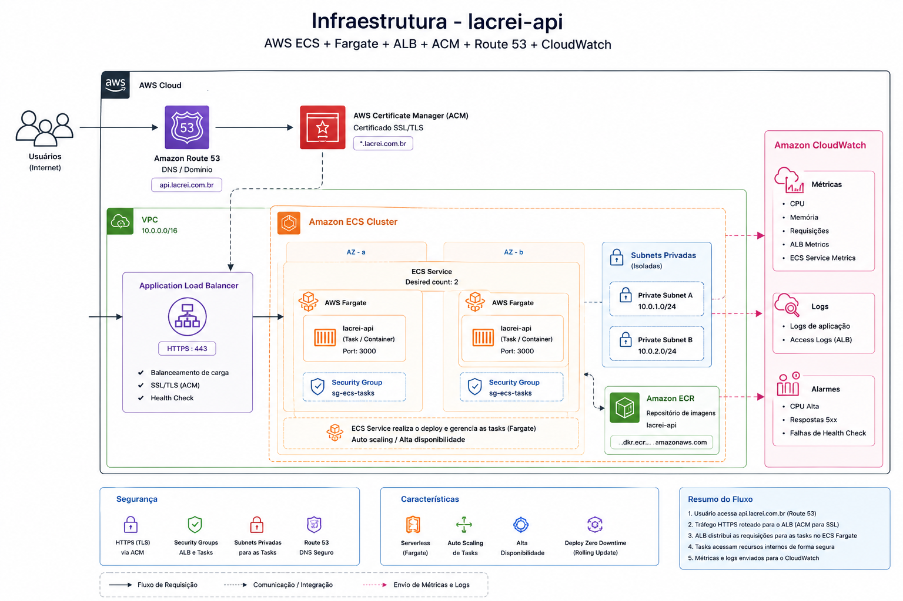

# Lacrei Saúde — Desafio Técnico de DevOps

API fictícia em Node.js (rota `/status`), containerizada com Docker e implantada em dois ambientes na AWS (staging e produção), com pipeline de CI/CD automatizado via GitHub Actions.

## Sumário

- [Arquitetura](#arquitetura)
- [Ambientes](#ambientes)
- [Pipeline de CI/CD](#pipeline-de-cicd)
- [Segurança](#segurança)
- [Observabilidade e monitoramento](#observabilidade-e-monitoramento)
- [Rollback](#rollback)
- [Checklist de segurança](#checklist-de-segurança)
- [Como rodar localmente](#como-rodar-localmente)

---

## Arquitetura

A aplicação roda em dois serviços **Amazon ECS (Fargate)** — um para staging e outro para produção — atrás de um **Application Load Balancer (ALB)** único, que direciona o tráfego para cada ambiente. As imagens Docker são versionadas e armazenadas no **Amazon ECR**, e os logs de aplicação/deploy são centralizados no **CloudWatch**, com alarmes configurados para notificar por e-mail em caso de anomalia.

```
[GitHub Actions - CI] → [Amazon ECR] → [ECS Service: staging]  ─┐
                                     → [ECS Service: produção] ─┼─→ [ALB] → Internet
                                                                 │
                                                          [CloudWatch Logs + Alarmes → E-mail]
```

<!-- Adicione aqui a imagem da arquitetura (ex.: docs/architecture.png) -->


> *Substitua a imagem acima pelo diagrama real da infraestrutura (pode ser exportado do Excalidraw, Miro, draw.io ou até um desenho da AWS Console).*

---

## Ambientes

| Ambiente   | Serviço ECS                              | Cluster         | Trigger de deploy                          |
|------------|-------------------------------------------|-----------------|---------------------------------------------|
| Staging    | `lacrei-api-staging-service-ekt1ep1s`     | `lacrei-cluster`| Push/PR na branch `staging`                  |
| Produção   | `lacrei-api-service`                       | `lacrei-cluster`| Push/PR na branch `master`                   |

Ambos os serviços rodam em **Fargate** (sem gerenciamento de servidores/EC2 subjacente), compartilhando o mesmo cluster ECS, porém com task definitions, variáveis e ciclo de deploy independentes — uma falha ou deploy em staging não afeta produção.

---

## Pipeline de CI/CD

O pipeline é dividido em três workflows do GitHub Actions:

### 1. `ci.yml` — Integração Contínua
Disparado em todo `push` ou `pull_request` para as branches `master` e `staging`.

1. Checkout do código
2. Setup do Node.js 22 (com cache de `npm`)
3. `npm ci` — instalação determinística das dependências
4. `npm run lint` — padronização e qualidade de código
5. `npm test` — testes automatizados
6. Build da imagem Docker (via Buildx, com cache do GitHub Actions)
7. Sobe um container local da imagem recém-buildada
8. **Health check**: tenta `curl http://localhost:3000/status` por até 30 tentativas (60s), validando que a aplicação realmente sobe antes de qualquer deploy
9. Encerra e remove o container de teste (`if: always()`, mesmo se o health check falhar)

Esse workflow é o portão de qualidade: nenhuma imagem chega a ser publicada ou implantada sem passar por lint, testes e a validação real do container rodando.

### 2. `cd.yml` — Deploy em Produção
Disparado via `workflow_run` **apenas** quando o workflow `ci` termina com sucesso (`conclusion == 'success'`) na branch `master`.

1. Configura as credenciais da AWS (via GitHub Secrets)
2. Login no Amazon ECR
3. Build da imagem com a tag `${{ github.sha }}` (rastreável ao commit exato) + tag `latest`
4. Sobe novamente um container local e roda o health check (`curl --fail`) antes de publicar — segunda camada de validação, agora com a imagem final
5. Push da imagem para o ECR (SHA + `latest`)
6. Atualiza a task definition (`task-definition.json`) com a nova imagem
7. Deploy no ECS (`ecs-deploy-task-definition`), aguardando a estabilização do serviço (`wait-for-service-stability: true`) antes de considerar o deploy concluído

### 3. `cd-staging.yml` — Deploy em Staging
Mesma lógica do workflow de produção, mas disparado quando o `ci` termina com sucesso na branch `staging`, usando `task-definition-staging.json` e o serviço `lacrei-api-staging-service-ekt1ep1s`.

### Por que `workflow_run` em vez de `push` direto no CD?
Separar CI e CD em workflows distintos, conectados por `workflow_run`, garante que o deploy só é disparado **depois** que o CI passou de ponta a ponta — inclusive lint e testes — e não apenas pelo evento de push, evitando qualquer corrida entre os dois pipelines.

---

## Segurança

- **Secrets**: credenciais da AWS (`AWS_ACCESS_KEY_ID`, `AWS_SECRET_ACCESS_KEY`, `AWS_REGION`) armazenadas como GitHub Secrets, nunca versionadas no código.
- **Permissions mínimas nos workflows**: `permissions: contents: read` explícito nos jobs de CD.
- **Imagens versionadas por SHA**: cada deploy é rastreável a um commit exato, facilitando auditoria e rollback.
- **Isolamento entre ambientes**: task definitions, variáveis e serviços ECS separados entre staging e produção — nenhum recurso sensível de produção é reutilizado em staging.
- **Validação em múltiplas camadas**: a mesma checagem de saúde (`/status`) é executada tanto no CI (antes de qualquer publicação) quanto no CD (antes do push da imagem final), reduzindo a chance de uma imagem quebrada chegar ao ECS.

---

## Observabilidade e monitoramento

- Logs de aplicação e da execução das tasks do ECS centralizados no **Amazon CloudWatch Logs**.
- Alarmes configurados no CloudWatch para métricas de erro/indisponibilidade, com notificação automática enviada por **e-mail** (via SNS) sempre que uma anomalia é detectada.
- `wait-for-service-stability: true` no deploy garante que o pipeline só é considerado concluído quando o ECS confirma que as novas tasks estão saudáveis, servindo como uma primeira linha de observabilidade do próprio deploy.

---

## Rollback

Ainda não executamos um rollback em produção neste ciclo, mas a estratégia foi desenhada desde o início do pipeline para tornar esse processo rápido e seguro quando for necessário. Veja como seria:

### Por que já estamos preparados para isso
Cada imagem publicada no ECR é marcada com a tag do commit (`github.sha`), e cada deploy no ECS gera automaticamente uma **nova revisão da task definition** (o ECS nunca sobrescreve a anterior — ele mantém um histórico). Isso significa que "voltar atrás" é, na prática, apontar o serviço para uma revisão ou imagem que já sabemos que funcionou.

### Passo a passo do rollback

**Opção 1 — Reverter para a revisão anterior da task definition (mais rápido)**
```bash
# 1. Listar as últimas revisões da task definition do serviço afetado
aws ecs list-task-definitions \
  --family-prefix lacrei-api-service \
  --sort DESC

# 2. Apontar o serviço para a revisão anterior estável (ex.: revisão N-1)
aws ecs update-service \
  --cluster lacrei-cluster \
  --service lacrei-api-service \
  --task-definition lacrei-api-service:REVISAO_ANTERIOR \
  --force-new-deployment
```

**Opção 2 — Reverter via imagem no ECR (quando a task definition atual não é o problema)**
```bash
# Reutilizar a imagem de um commit anterior conhecido como estável
docker pull <REGISTRY>/lacrei-api:<SHA_ANTERIOR>
docker tag <REGISTRY>/lacrei-api:<SHA_ANTERIOR> <REGISTRY>/lacrei-api:latest
docker push <REGISTRY>/lacrei-api:latest
# e então repetir o update-service acima usando essa tag
```

**Opção 3 — Re-executar o workflow de CD de um commit anterior**
Como o deploy é 100% automatizado a partir do `workflow_run`, também é possível fazer um `revert` do commit problemático no Git e dar push novamente — o pipeline de CI/CD cuida do resto (build, validação e deploy) sem intervenção manual na AWS.

### Critério para decidir qual opção usar
- **Minutos após o deploy, com o serviço fora do ar** → Opção 1 (mais rápida, não depende de rebuild).
- **Problema identificado na imagem, não na configuração** → Opção 2.
- **Preferência por manter o histórico do Git íntegro e auditável** → Opção 3.

### Validação pós-rollback
Em todos os casos, o passo final é o mesmo aplicado no deploy normal: aguardar `wait-for-service-stability` e confirmar `curl https://<dominio-ou-alb>/status` retornando `200 OK` antes de considerar o incidente encerrado.

### Evolução futura recomendada
Para reduzir ainda mais o tempo de rollback, o próximo passo seria migrar para uma estratégia **Blue/Green** nativa do ECS (via CodeDeploy), mantendo duas versões do serviço ativas simultaneamente e trocando o tráfego no ALB apenas após validação completa — eliminando até o tempo de estabilização de um novo deploy.

---

## Checklist de segurança

| Item | Status |
|---|---|
| Segredos fora do repositório (GitHub Secrets) | ✅ |
| Isolamento entre staging e produção | ✅ |
| Imagens versionadas por commit (SHA) | ✅ |
| Health check antes da publicação e antes do deploy | ✅ |
| Permissões mínimas nos workflows (`contents: read`) | ✅ |
| Logs centralizados (CloudWatch) | ✅ |
| Alertas de monitoramento (e-mail) | ✅ |
| HTTPS/TLS nos ambientes | ⚠️ Proposto — não implementado por falta de domínio próprio disponível |
| Rollback testado em produção | ⚠️ Documentado, ainda não executado em um incidente real |

---

## Como rodar localmente

```bash
# instalar dependências
npm ci

# rodar localmente
npm start

# ou via Docker
docker build -t lacrei-api .
docker run -p 3000:3000 lacrei-api

# testar
curl http://localhost:3000/status
```
